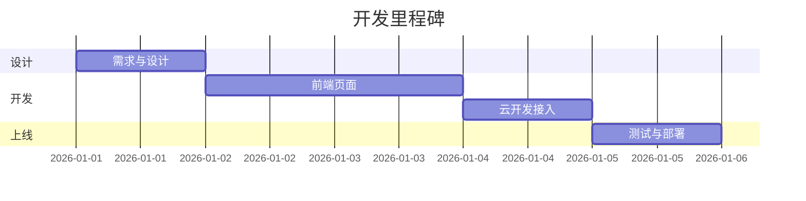

# 项目开发计划

## 2.1 项目目标

开发一个 H5 报修接单系统，实现：

1. 客户扫码填写报修工单（含文字描述 + 照片上传）
2. 工单数据存入云数据库
3. 包工头在后台查看、管理所有工单

## 2.2 开发进度计划

| 阶段 | 任务 | 预计时间 | 交付物 |
|------|------|----------|--------|
| 第 1 天 | 需求分析、数据库设计、UI 设计 | 1 天 | 需求/设计文档 |
| 第 2-3 天 | 前端页面开发（表单 + 提交成功页） | 2 天 | index.html、success.html |
| 第 4 天 | 云开发接入（数据库 + 存储配置） | 1 天 | 可提交工单的完整流程 |
| 第 5 天 | 测试、部署上线、生成二维码 | 1 天 | 线上链接 + 二维码 |
| **合计** | | **5 天** | 可上线 MVP |

## 2.3 资源需求

| 类型 | 内容 |
|------|------|
| 人力资源 | 1 人（包工头本人，借助 Cursor AI 编程） |
| 软件资源 | Cursor、微信开发者工具、Node.js（可选） |
| 硬件资源 | 一台电脑、一部手机 |

## 2.4 里程碑

## 2.5 风险与应对

| 风险 | 影响 | 应对 |
|------|------|------|
| 云开发环境未开通 | 无法存数据 | 第一天先完成云开发开通 |
| 微信外浏览器云能力受限 | 部分用户无法上传 | MVP 优先微信扫码场景 |
| 数据库权限配置错误 | 提交失败 | 开发阶段用宽松权限，上线前收紧 |
