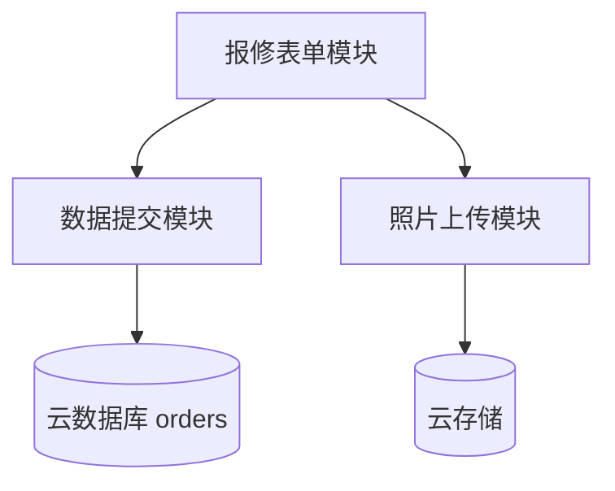

# 概要设计说明书

## 4.1 系统总体架构

```
┌─────────────────────────────────────────────┐
│                 客户手机端                    │
│         (微信扫码 / 浏览器打开)              │
└─────────────────┬───────────────────────────┘
                    │ HTTPS
                    ▼
┌─────────────────────────────────────────────┐
│            微信云开发平台                     │
│  ┌───────────┐  ┌───────────┐  ┌─────────┐ │
│  │ 静态托管   │  │ 云数据库  │  │ 云存储  │ │
│  │ (H5页面)  │  │ (工单数据)│  │ (照片)  │ │
│  └───────────┘  └───────────┘  └─────────┘ │
└─────────────────┬───────────────────────────┘
                    │
                    ▼
┌─────────────────────────────────────────────┐
│              管理员（包工头）                 │
│         云开发控制台 / 腾讯云助手            │
└─────────────────────────────────────────────┘
```

## 4.2 模块划分

| 模块 | 功能 | 技术实现 |
|------|------|----------|
| 报修表单模块 | 展示表单、收集输入、前端校验 | HTML + CSS + JavaScript |
| 照片上传模块 | 相机/相册选图，上传云存储 | 微信云开发 SDK |
| 数据提交模块 | 表单数据写入云数据库 | 微信云开发 SDK |
| 工单管理模块 | 查看列表与详情 | 云开发控制台 |
| 状态管理模块 | 更新工单状态 | 控制台手动编辑 |

## 4.3 技术选型

| 技术 | 选型 | 理由 |
|------|------|------|
| 前端 | 原生 HTML/CSS/JS | 单页简单，无构建步骤 |
| 后端 | 微信云开发 | 免服务器，免费额度够用 |
| 数据库 | 云数据库 | 与云开发原生集成 |
| 存储 | 云存储 | 图片托管 |
| 部署 | 静态托管 | 一键 HTTPS |

## 4.4 部署视图

| 组件 | 部署位置 |
|------|----------|
| index.html、success.html | 云开发静态托管 |
| css/、js/ | 云开发静态托管 |
| orders 集合 | 云数据库 |
| 用户上传图片 | 云存储 `/orders/` 路径 |

## 4.5 模块依赖


