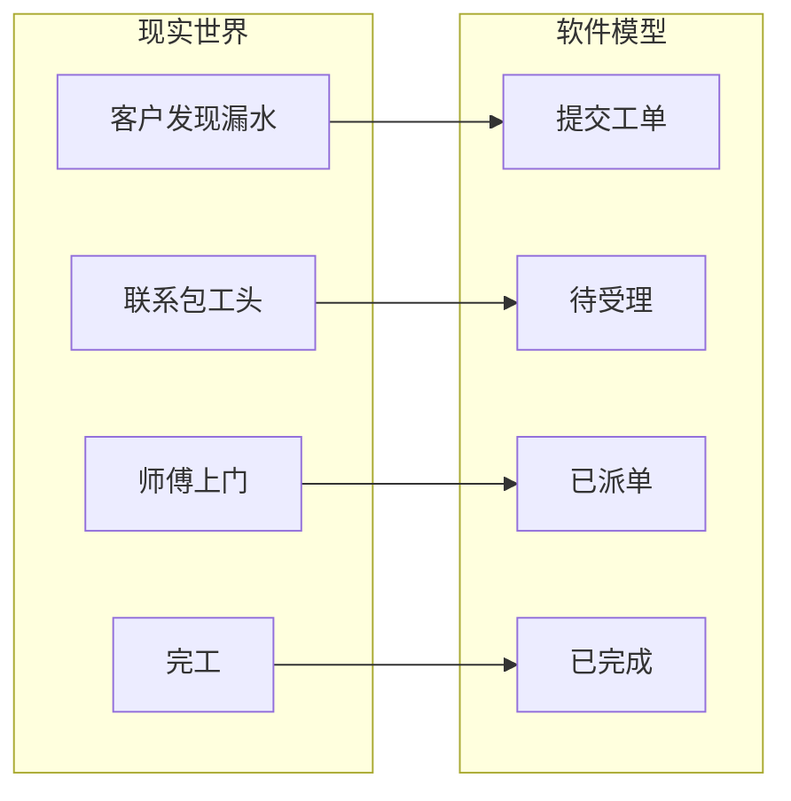
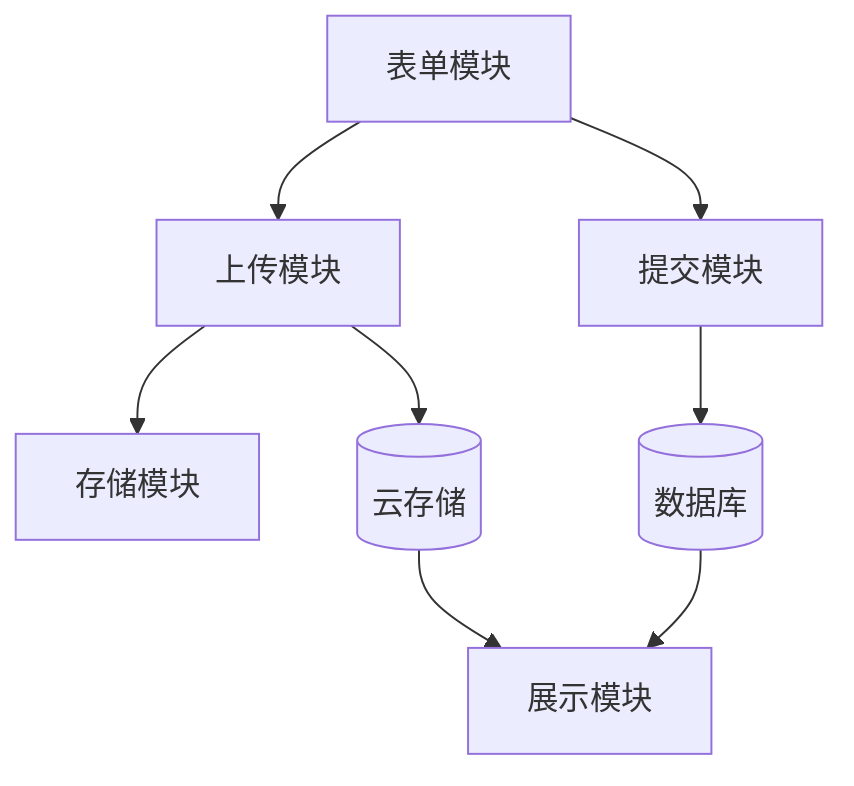

# 软件工程特征说明

对应课程/任务书七大工程特征的本项目说明。

---

## 特征 1：运用工程原理

本系统采用**前后端分离**思想：前端负责界面交互与数据采集，云开发承担数据持久化与文件存储。实现中需理解 HTTP/HTTPS、文档数据库读写、异步文件上传等原理，并落实到编码与权限配置中。

**本项目体现：**

- 静态托管提供 H5 访问
- 云数据库 CRUD
- 云存储 uploadFile 流程

---

## 特征 2：多因素综合权衡

设计时在以下因素间折中：

| 因素 | 选择 | 权衡 |
|------|------|------|
| 易用性 | 扫码即填，无注册 | 牺牲账号体系换取低门槛 |
| 成本 | 云开发免费额度 | 接受平台绑定 |
| 安全 | 开发期开放读写 | 上线前收紧权限 |
| 可靠 | 云开发自带备份 | 依赖腾讯云 SLA |

---

## 特征 3：抽象建模

将现实「报修流程」抽象为软件模型：

- **用例图**：客户提交、管理员处理（见需求规格说明书）
- **状态机**：待受理 → 已派单 → 已完成
- **数据模型**：orders 集合字段

---

## 特征 4：非仅常用方法

传统方式：电话/微信口述，信息零散。本系统将**结构化表单 + 照片 + 数据库**整合为扫码即用 H5，实现信息标准化与可追溯，是传统人工接单难以单独完成的。

---

## 特征 5：超标准规范

以下问题无单一国标可直接套用，需结合场景自主解决：

- 微信内置浏览器与纯 H5 的 API 差异
- 移动端 touch 区域与 fixed 底栏适配
- 图片体积与上传成功率平衡
- 云开发 Web SDK 在非微信环境的降级策略

---

## 特征 6：利益不一致

| 角色 | 诉求 |
|------|------|
| 客户 | 快速响应、少跑腿 |
| 包工头 | 筛选有效单、降低空跑 |

**系统平衡手段：**

- 紧急情况多选 → 包工头提前判断优先级
- 照片上传 → 减少「到了才发现不是防水问题」
- 期望时段 → 减少无效等待

---

## 特征 7：多子问题关联

系统由多个相互依赖的子问题构成：

任一模块失败都会导致端到端流程中断，体现软件系统的**综合性与耦合性**。
